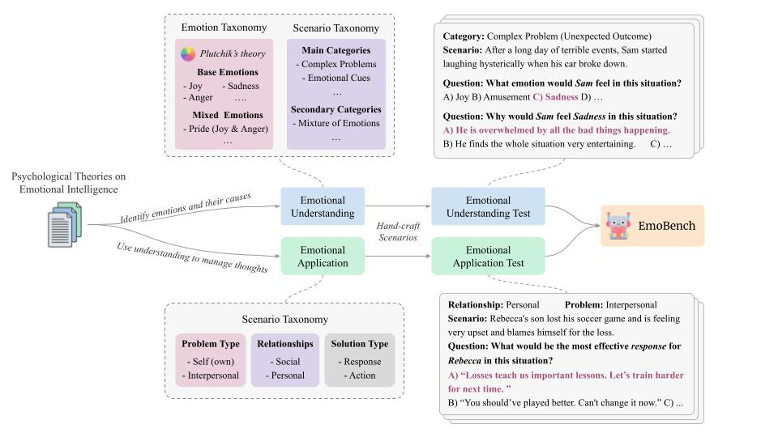

# EmoBench
> This is the official repository for our paper ["EmoBench: Evaluating the Emotional Intelligence of Large Language Models"](https://aclanthology.org/2024.acl-long.326/)

 <a href="https://huggingface.co/datasets/SahandSab/EmoBench"> </a> 

## Overview

EmoBench is a comprehensive and challenging benchmark designed to evaluate the Emotional Intelligence (EI) of Large Language Models (LLMs). Unlike traditional datasets, EmoBench focuses not only on emotion recognition but also on advanced EI capabilities such as emotional reasoning and application.

The dataset includes **400 hand-crafted scenarios** in English and Chinese, structured into two key evaluation tasks:

- **Emotional Understanding (EU):** Recognizing emotions and their causes in complex scenarios.
- **Emotional Application (EA):** Recommending effective emotional responses or actions in emotionally charged dilemmas.



## Key Features

- **Psychology-based Design:** Grounded in established theories of Emotional Intelligence (e.g., Salovey & Mayer, Goleman).
- **Bilingual Support:** Scenarios are available in both English and Chinese.
- **Challenging Scenarios:** Includes nuanced emotional dilemmas that require reasoning and perspective-taking.
- **Annotations:** High-quality multi-label annotations verified through rigorous inter-annotator agreement (Fleiss' Kappa = 0.852).

## Dataset Structure

### Emotional Understanding

- **Categories:** Complex Emotions, Emotional Cues, Personal Beliefs and Experiences, Perspective-taking.
- **Example:**
   *Scenario:* After a long day of terrible events, Sam started laughing hysterically when his car broke down.
   *Task:* Identify the emotion (e.g., sadness, joy) and its cause.

### Emotional Application

- **Categories:** Divided based on Relationship types (Personal, Social), Problem types (Self, Others) and Question types (Response, Action).
- **Example:**
   *Scenario:* Rebecca's son lost his soccer game and is feeling upset and blaming himself.
   *Task:* identify the most effective response or action.


## Usage Guide

1. Create an `.env` file in the root directory (if you are using API models)

   ```bash
   API_KEY=<Your API Key>
   API_URL=<API Endpoint (if you are using a third-party API)
   ```

2. Install requirements

   ```bash
   pip install -r requirements.txt
   ```

3. Run the following command

   ```bash
   python src/main.py \
     --model_type ["openai", "openai-compatible", "HF"] \
     --model_path [model_path] \
     --lang ["en", "zh", "all"] \
     --task ["EU", "EA", "all"]\
     --device [device] \
     [--use_cot] \
     [--eval_only]
   ```

`--model_type`: type of the model from supported APIs or Huggingface (HF)

`--model_path`: the path to model weights or name of the model to evaluate. Defaults to "gpt-4o".

`--lang`: the language for the evaluation. Choose `all` for both.

`--task`: the task for generation. Choose `all` for both.

`--device`: the ID of the GPU to run the model. Defaults to `-1` for `cpu`.

`--use_cot`: enables chain-of-thought reasoning. Defaults to `False`.

`--eval_only`: only evaluate results (without generation). Defaults to `False`.

## Supported APIs

1. OpenAI
2. OpenAI Compatible (e.g., openrouter, deepseek, etc.)
3. Huggingface

## Citation
If you find our work useful for your research, please kindly cite our paper as follows:
```
@inproceedings{sabour-etal-2024-emobench,
    title = "{E}mo{B}ench: Evaluating the Emotional Intelligence of Large Language Models",
    author = "Sabour, Sahand  and
      Liu, Siyang  and
      Zhang, Zheyuan  and
      Liu, June  and
      Zhou, Jinfeng  and
      Sunaryo, Alvionna  and
      Lee, Tatia  and
      Mihalcea, Rada  and
      Huang, Minlie",
    editor = "Ku, Lun-Wei  and
      Martins, Andre  and
      Srikumar, Vivek",
    booktitle = "Proceedings of the 62nd Annual Meeting of the Association for Computational Linguistics (Volume 1: Long Papers)",
    month = aug,
    year = "2024",
    address = "Bangkok, Thailand",
    publisher = "Association for Computational Linguistics",
    url = "https://aclanthology.org/2024.acl-long.326",
    doi = "10.18653/v1/2024.acl-long.326",
    pages = "5986--6004"
}
```
